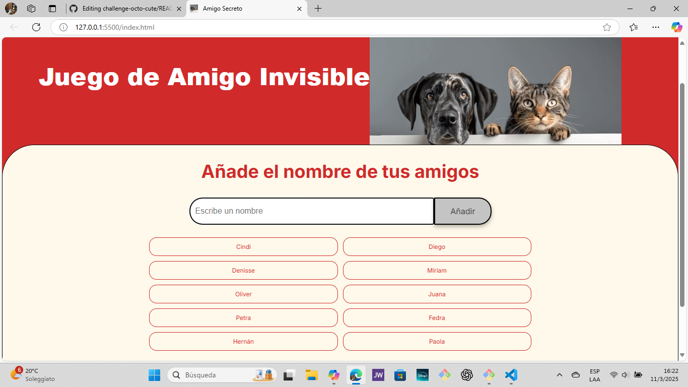
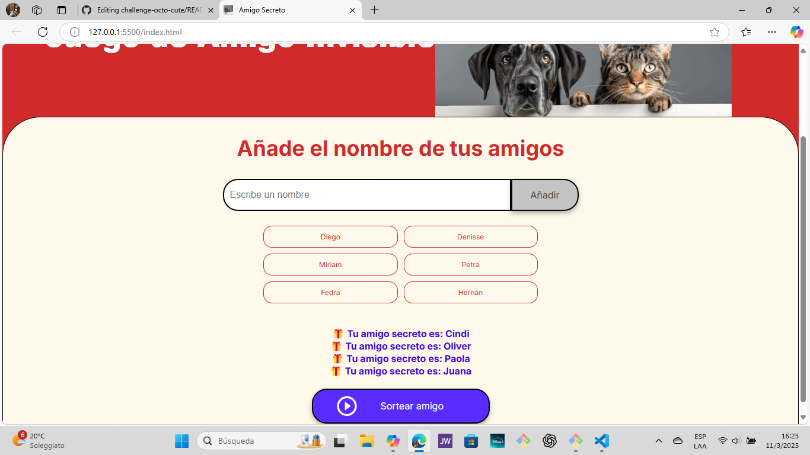

# Amigo Invisible
Proyecto web para jugar sorteando nombres y descubriendo al "Amigo Invisible".
# Juego de Amigo Invisible

## Descripción
Este proyecto es una aplicación web para organizar un juego de Amigo Invisible entre amigos. Permite añadir los nombres de los participantes y realizar el sorteo de manera fácil y divertida.

## Funcionalidades
- **Añadir nombres**: Los participantes pueden añadir sus nombres a la lista.
- **Sorteo de Amigo Invisible**: Realiza el sorteo para asignar un amigo secreto a cada participante.
- **Confetti de celebración**: Incluye una animación de confetti al finalizar el sorteo.
- **Reproducción de audio**: Reproduce un sonido de celebración al completar el sorteo.

## Lógica del Proyecto
El proyecto utiliza JavaScript para gestionar la lógica del juego. Aquí hay un resumen de las funciones principales:

- **iniciarJuego()**: Inicializa el juego, limpiando las listas de amigos y amigos sorteados.
- **agregarAmigo()**: Añade un nuevo nombre a la lista de amigos, con validaciones para evitar nombres duplicados y un máximo de 10 amigos.
- **mostrarListaAmigos()**: Muestra la lista actual de amigos en la interfaz.
- **sortearAmigo()**: Realiza el sorteo de un amigo secreto, asegurándose de que no se repitan amigos sorteados. Actualiza la lista de amigos y muestra los resultados.
- **lanzarConfettiYSonido()**: Lanza una animación de confetti y reproduce un sonido de celebración al finalizar el sorteo.

## Capturas de Pantalla


*Captura de pantalla mostrando la interfaz del juego.*

## Videos
[challenge-octo-cute](assets/miVideo.mp4)
*Video demostrando cómo añadir nombres y realizar el sorteo.*

## Instalación
1. Clona el repositorio:
   ```bash
   git clone https://github.com/tu_usuario/tu_repositorio.git
